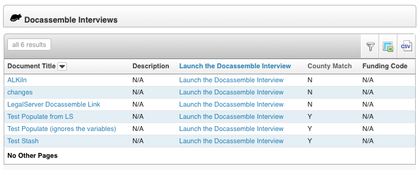

# LegalServer and Docassemble Link

This Docassemble package links [LegalServer](https://www.legalserver.org) with a
Docassemble Server, allowing Docassemble developers to:

* Use LegalServer as a data source for Docassemble templates, and
* Save documents generated in Docassemble interviews back to relevant case files
in LegalServer.



## Introduction

Using LegalServer's [Docassemble Integration module](https://help.legalserver.org/article/2754-docassemble-integration),
LegalServer will read a new Docassemble API endpoint with a list of Docassemble
interviews. Later, when those interviews are selected from a LegalServer case,
LegalServer will pass the case's unique UUID to Docassemble.

The sample interview and python module in this Docassemble package then provide
a method to obtain the case's unique UUID, make API calls to LegalServer to read
the case data, and then translate the API responses into proper Docassemble objects.

> ⚠️ Warning
>
> This package results in granting access to your LegalServer data to Docassemble
users. See [Interview Security](#interview-security) for instructions on preventing
unauthorized data access.

## Requirements

* Docassemble 1.4.54 or greater (if installed on an older version of Docassemble,
it will try to upgrade it to this version.) This package requires Python 3.10
which is only available on Docassemble 1.4.54 or later. If you are on Docassemble
1.4.53 or earlier, you will need to do an upgrade of your container for Docassemble,
upgrading in the Package Management settings page will not be sufficient.
* LegalServer's [API v2](https://apidocs.legalserver.org/docs/ls-apis/ky42lgd4au6t0-legal-server-core-api-v2)
* LegalServer's Docassemble Integration module ([contact LegalServer support](mailto:support@legalserver.org)
for a change order to enable)

## Configuration

### Docassemble Configuration

In your Docassemble configuration file, you will need to have the following yaml
structure:

```(YAML)
legalserver:
  mysite-demo:
    bearer: BEARER_TOKEN_1_HERE
    expiration: 2024-12-15
    report 123: bdbda58e-c244-4337-ada2-34df1e3b866e 
  mysite:
    bearer: BEARER_TOKEN_2_HERE
    expiration: 2024-12-15
    report 456: 00cefa38-819b-4387-a207-38a7e33e61e0  
  interviews: 
    - interview: docassemble.LegalServerLink:data/questions/sample_letter.yml
      name: Sample Client Letter
      external: False
```

The keys for `mysite-demo` and `mysite` will allow your Docassemble server to
work with both your Live site and you Demo site. The LegalServer site
abbreviations need to be lower case to ensure that the text matching to find the
correct API keys will work as expected. The bearer tokens can be created in
LegalServer using the [Manage Personal Access Tokens Block](https://help.legalserver.org/article/2469-manage-personal-access-tokens-block).
The `expiration` keys are required to allow Docassemble to ensure that the
bearer tokens are still valid.

The key for the report is only relevant if you are using the
`get_legalserver_report_data` function to retrieve data from a [LegalServer
Reports API](https://help.legalserver.org/article/1751-reports-api) call in
addition to the standard LegalServer
APIs. In this case, the report number is `123` and that is identified in the url
of the report in the LegalServer UI. It is also identified as the `load` query
parameter in the sample Report API call url provided by the LegalServer UI. The
uuid that accompanies that report key is the `api_key` query parameter provided
by the LegalServer UI for that specific report.

The list under `interviews` allows you to have a unique list of Interviews
linked to LegalServer that is separate and distinct from the Dispatch list you
may be using elsewhere with Docassemble. If an interview is marked as `external`
LegalServer will provide a read-only link instead of a clickable hyperlink. This
way the link can be copied for a client to complete on their own later.

### LS Interviews Docassemble Endpoint

This package also adds a new API endpoint to your Docassemble server. You can
now send an authenticated `get` request to `/lsinterviews`. This will return
the list that appears in your configuration file under the keys:

```(YAML)
legalserver:
  interviews:
```

To use this endpoint, you need to have the `legalserver` user role privilege in
Docassemble. This can be established by going to your [User List](https://docassemble.org/docs/admin.html#user%20list),
selecting `Edit Privileges`, and adding `legalserver` to the list. Then you
need to give the `legalserver` role to any of the accounts creating a
docassemble API key for LegalServer.

LegalServer will attempt to connect to this endpoint to retrieve the list of
available interviews.

### LegalServer API Configuration

This package assumes that you are using LegalServer's v2 API. This is not
available by default, so please file a request with
[support@legalserver.org](mailto:support@legalserver.org) to enable it. This is
to provide more information to the Docassemble developer as well as use clearer
data structures.

The bearer tokens used in the this integration should be linked to a dedicated
API account with a dedicated API User Role. To create the bearer tokens, use the
LegalServer [Manage Personal Access Tokens Block](https://help.legalserver.org/article/2469-manage-personal-access-tokens-block).
For more details, see [API Authentication](https://apidocs.legalserver.org/docs/ls-apis/b6b6c2d4906e9-api-authentication).
The User Role needs to have the following permissions:

* API Access
* API Get Matter
* API Documents Webhook
* API Get Contact
* API Get Organization
* API Get User
* API Get/Search Matter Full Results

Optional additional permissions:

* API Access all Cases
* API Get Matter Additional Name
* API Get Matter Adverse Party
* API Get Matter Assignment
* API Get Matter Contact
* API Get Matter Incomes
* API Get Matter Litigations
* API Get Matter Notes
* API Get Matter Service
* API Get Matter Include Additional Names
* API Get Matter Include Adverse Parties
* API Get Matter Include Events
* API Get Matter Include Non Adverse Parties
* API Get Matter Include Notes
* API Get Matter Include Tasks
* API Get Matter Non Adverse Party
* API Search Contact
* API Search Event
* API Search Matter Additional Name
* API Search Matter Adverse Party
* API Search Matter Assignments
* API Search Matter Contact
* API Search Matter Incomes
* API Search Matter Include Additional Names
* API Search Matter Include Adverse Parties
* API Search Matter Include Events
* API Search Matter Include Non Adverse Parties
* API Search Matter Include Notes
* API Search Matter Include Tasks
* API Search Matter Litigation
* API Search Matter Non Adverse Party
* API Search Matter Notes
* API Search Matter Service
* API Search Organizations
* API Search Tasks
* API Search Users
* API Search Users Organization Affiliation

Please remember that the token expires 1 year after it is created. The package
will warn you when the token has expired.

Note that all of the endpoints are included in the base level of API Access.
Premium APIs are not required.

## Using this Package

To use this package, you'll want to include the LSLink.yml file in any of your
interviews:

```(YAML)
includes:
  - docassemble-LSDocassembleLink:data/questions/LSLink.yml
```

### Interview Security

This package results in granting access to your LegalServer data to Docassemble
users. **To prevent unauthorized access to the data, LegalServer recommends that
any interviews using this package have authentication required.** This could
happen with the `require login: True` [metadata setting](https://docassemble.org/docs/initial.html#metadata)
or setting `required privileges` in the metadata to a limited scope excluding
`anonymous`.

### Getting Data

This can create numerous objects. None of these are required by the default code
but could be easily retrieved.

* **client**: Individual or Person depending on whether the Client is a Group
in LegalServer
* **client.additional_names**: DAList using IndividualName objects
* **legalserver_case**: DAObject
* **legalserver_adverse_parties**: DAList using Person objects
* **legalserver_assignments**: DAList of Individual objects
* **legalserver_charges**: DAList using DAObject objects
* **legalserver_contacts**: DAList using DAIndividual objects
* **legalserver_events**: DAList using DAObject objects
* **legalserver_tasks**: DAList using DAObject objects
* **legalserver_incomes**: DAList using DAObject objects
* **legalserver_litigations**: DAList using DAObject objects
* **legalserver_non_adverse_parties**: DAList using Person objects
* **legalserver_notes**: DAList using DAObject objects
* **legalserver_services**: DAList using DAObject objects
* **legalserver_primary_assignment**: Individual
* **legalserver_first_pro_bono_assignment**: Individual
* **legalserver_latest_pro_bono_assignment**: Individual
* **legalserver_pro_bono_assignments**: DAList using Individual objects
* **legalserver_current_user**: Individual

There is a code block that will check for url arguments and process them. This
can be called by requesting `collect_initial_legalserver_data`. The expectation
is that the url arguments will include a key and secret for data stored in
Docassemble's Redis Stash. Once that Redis stash is retrieved, there should be
variables for:

* `legalserver_site_abbreviation`
* `legalserver_site_type`
* `legalserver_matter_uuid`
* `legalserver_current_user_uuid`

The `legalserver_matter_uuid` variable is used to pull data back from a specific
case.

The `legalserver_current_user_uuid` allows for details about the user who
initiated the Docassemble Interview to be retrieved.

The `legalserver_site_abbreviation` and `legalserver_site_type` variables are
then combined to create the `legalserver_site` variable used by all of the
python functions in this package.

To then populate any of the objects above, you'll want to call the following
code blocks to parse the data:

* parse_client_data
* parse_legalserver_additional_name_data
* parse_legalserver_adverse_party_data
* parse_legalserver_assignment_data
* parse_legalserver_case_data
* parse_legalserver_charge_data
* parse_legalserver_contact_data
* parse_legalserver_event_data
* parse_legalserver_task_data
* parse_legalserver_income_data
* parse_legalserver_litigation_data
* parse_legalserver_non_adverse_party_data
* parse_legalserver_note_data
* parse_legalserver_service_data
* parse_legalserver_primary_assignment
* parse_legalserver_pro_bono_assignments (note: that this populates all three of
the pro bono objects indicated above if there is at least one pro bono assignment)
* parse_legalserver_current_user

Or you can call `parse_all_legalserver_data` and it will populate all of the
above objects.

### Returning Documents

When you have completed your interview in Docassemble, if you want to return a
document to LegalServer, you can use the
`post_file_to_legalserver_documents_webhook` function. This can take either an
individual document or a zip file of multiple documents and save that back to
the case. If a zip file is provided, LegalServer will automatically unzip the
files and add them to a case note on the case.

### Python Functions included

For simplicty, the public functions created by this Docassemble package are
described in [Functions](Functions.md).

## Sample Docassemble Interview

A sample file `sample_letter.yml` is available in this package. This Docassemble
interview has multiple steps in the creation of a letter to a client or attorney.

The offered text of the communication is stored as an optional [`DALazyTemplate`](https://docassemble.org/docs/objects.html#DALazyTemplate)
in the interview file so that it can use Mako formatting
and take any variables from the LegalServer Data. This means that any logic,
formatting, or variables can be included in the letter.

After it collects the LegalServer data, it then allows for the following choices:

* Recipient (default options include Client, Primary Attorney, Current User,
First Pro Bono Attorney, or Latest Pro Bono Attorney)
* Sender (Primary Attorney or Current User)
* Method of Email or printed Letter
* Letter Text (selecting the appropriate `DALazyTemplate`)
* Modifications to the text
* Letterhead choice (if sent via Letter)

The package then returns the files to the case if a Letter is sent. If an Email
is sent, it BCC's the case.

Any of the questions being asked in the interview could be hard coded
instead of questions for the user to answer. There is an example
code block that sets defaults. This example also uses the
[DACatchAll](https://docassemble.org/docs/fields.html#catchall) features to
ensure that any used variables have already been defined in case the selected
data was null in LegalServer.

## ChangeLog

See [ChangeLog](ChangeLog.md).

## Created By

This package was created by [Network Ninja, Inc.](https://networkninja.com), the
parent company of [LegalServer](https://legalserver.org).

For issues please contact [support@legalserver.org](mailto:support@legalserver.org).

## License

[MIT License](LICENSE)
